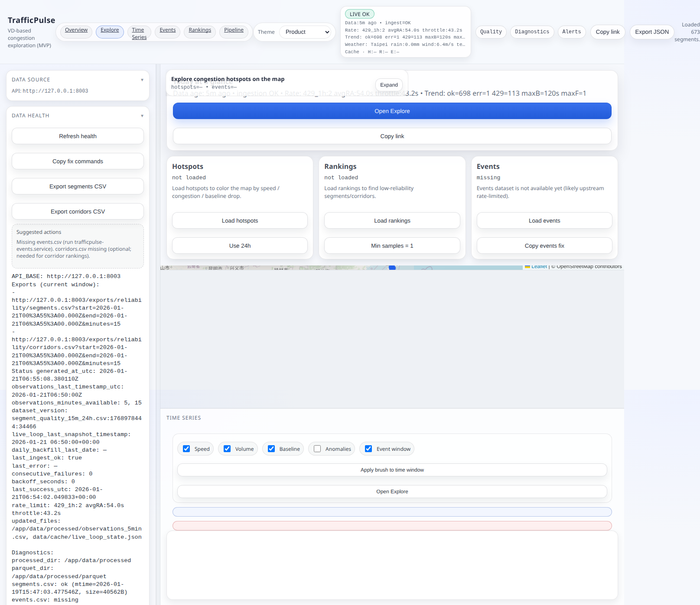
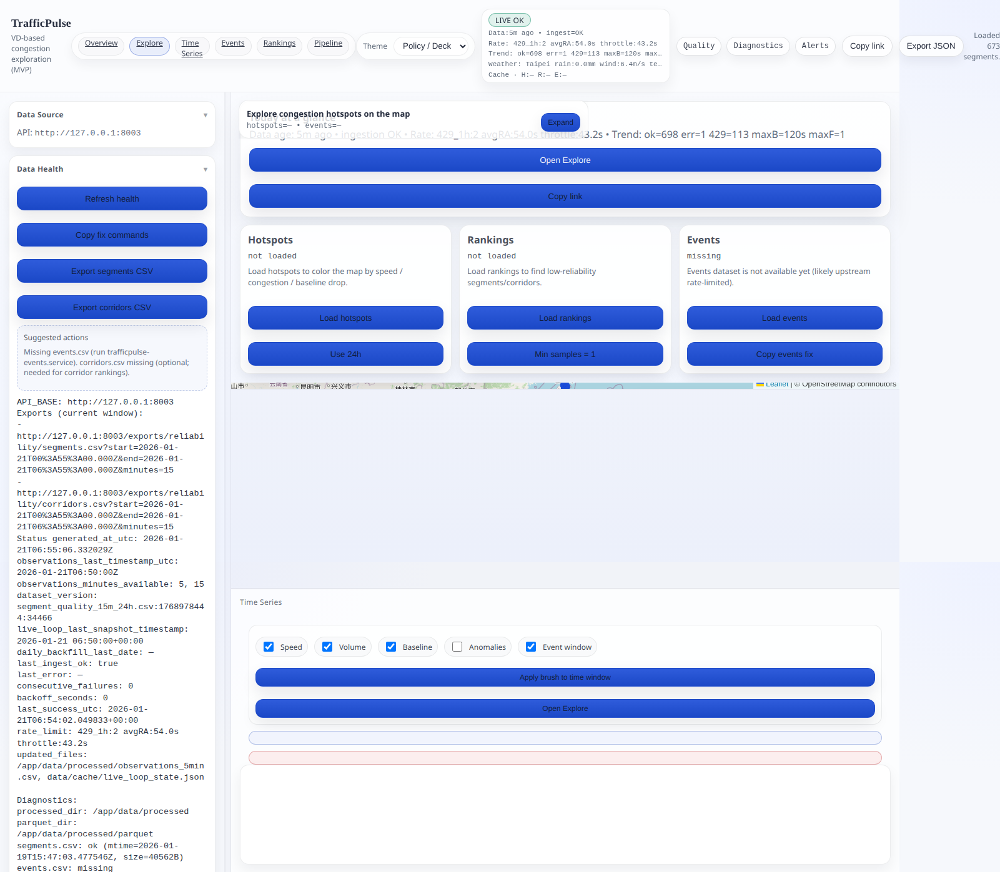
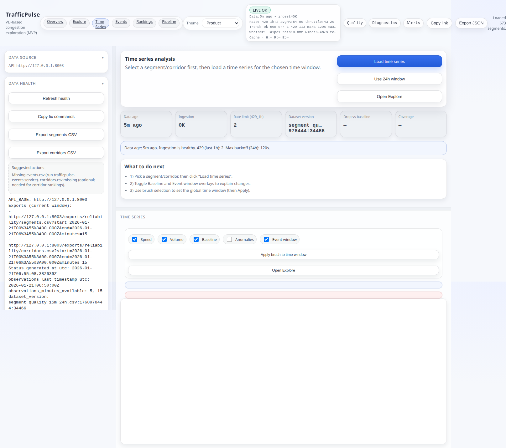
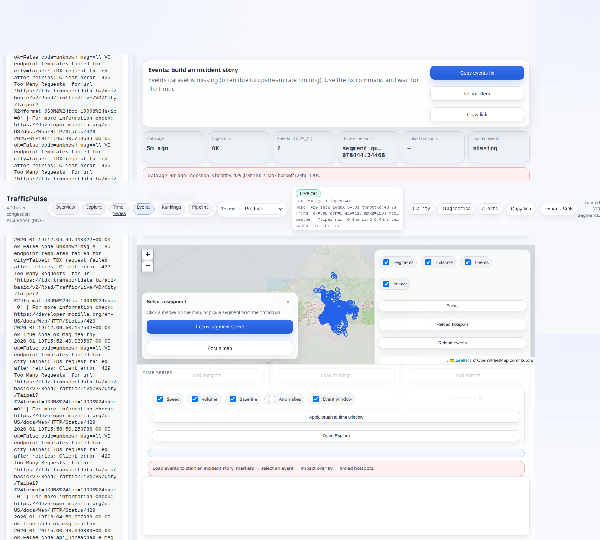
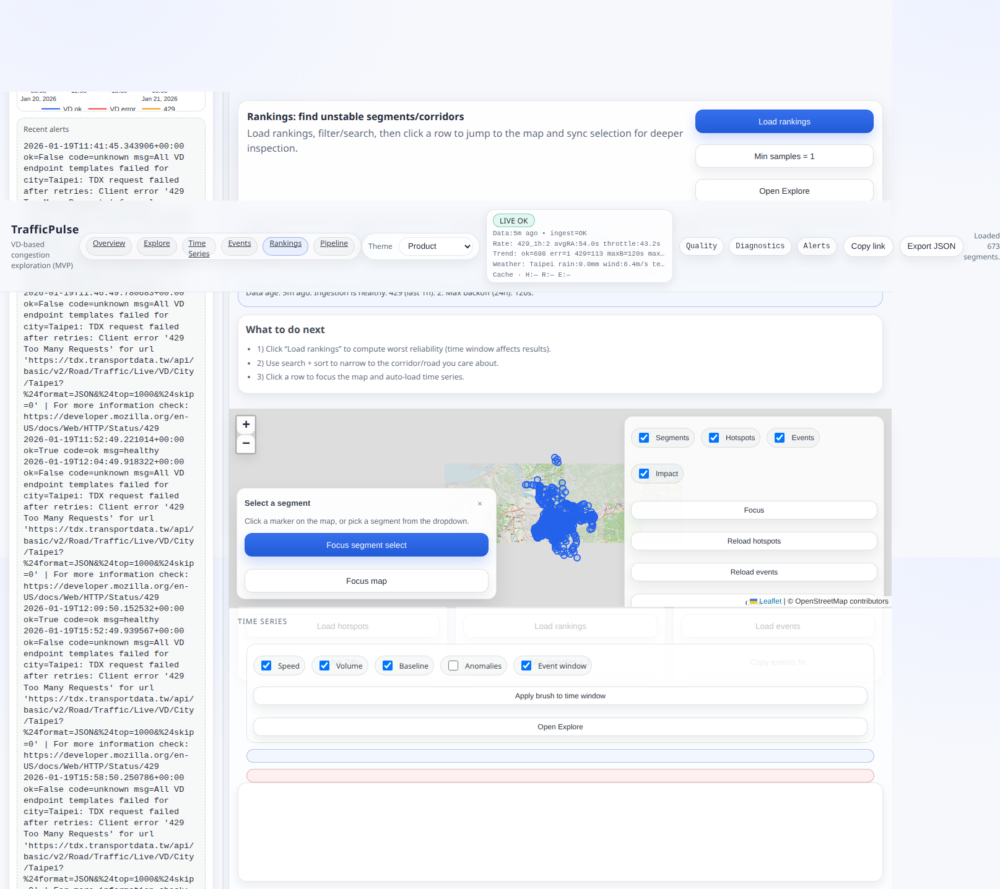
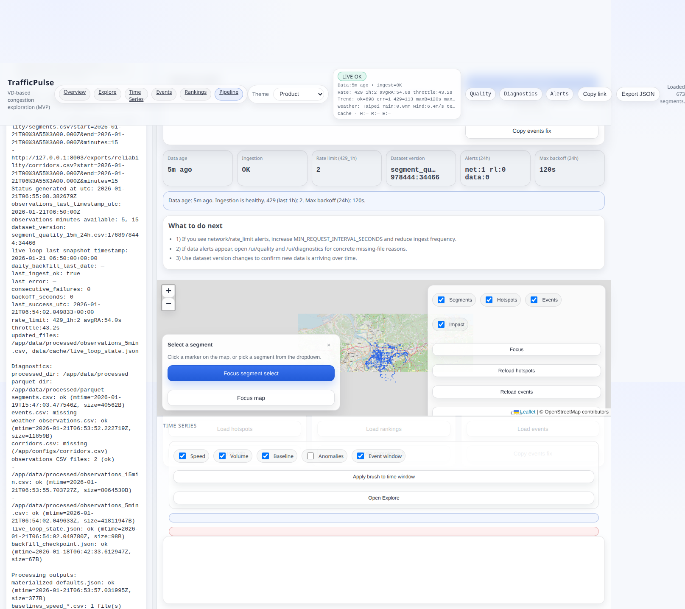
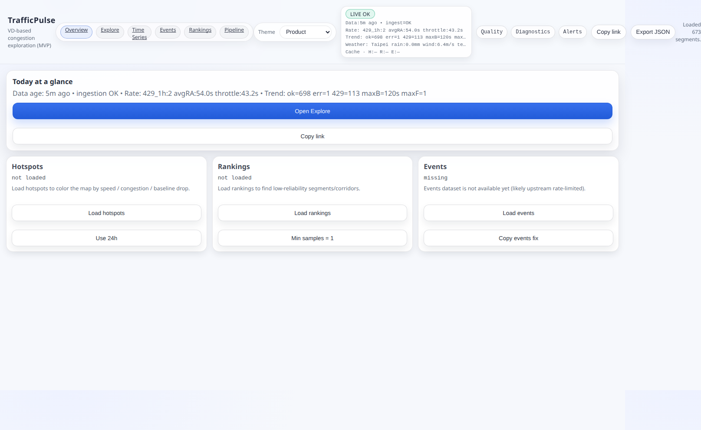

# TrafficPulse

TrafficPulse is a road congestion analytics and visualization web app for Taiwan, powered by TDX (Transport Data eXchange).

This repository is being developed in phases. **Phase 1 (MVP)** focuses on:
- Reproducible ingestion → preprocessing → analytics pipeline (Python)
- A FastAPI backend for segment metadata, time series, and reliability rankings
- A minimal map-based frontend for interactive exploration

## Latest Frontend (UI)

Recent UI upgrades focus on “map-first” storytelling and demo-ready presentation:
- Page-specific story KPIs:
  - Events: linked hotspots count
  - Time Series: drop vs baseline + coverage
  - Rankings: filtered count
- Actionable empty states: when a list is empty (no data / filtered out / dataset missing), the UI shows an empty-state card with one-click fixes (relax filters, widen time window, copy fix command, reload).
- Explore story overlay is collapsible by default to keep the map clean (click to expand).
- Unified theme tokens (product vs policy/deck mode), consistent focus rings, and better overlay spacing on mobile viewports.

Screenshots (generated by Playwright, stored in `docs/screenshots/`):

| Page | Screenshot |
| --- | --- |
| Explore |  |
| Explore (Policy) |  |
| Time Series |  |
| Events |  |
| Rankings |  |
| Pipeline |  |
| Overview |  |

## E2E Tests (Playwright)

The Playwright suite runs smoke checks and captures updated screenshots.

Prereqs:
- Node.js + npm
- Python 3 (for the local static server used by tests)

Install deps:

```bash
npm install
```

Install Playwright's bundled Chromium (only needed if it is not already present):

```bash
npm run pw:install
```

Run E2E tests (also writes screenshots to `docs/screenshots/`):

```bash
npm run test:e2e
```

Notes:
- Tests start a local static server: `python -m http.server 8003 --directory web`.
- The UI currently references Leaflet/Plotly via CDN; tests inject lightweight stubs so screenshots work even without external network access.

## Repository Layout (MVP)

```text
configs/          # YAML configs (copy examples into real configs)
data/             # Local data (raw/processed/cache)
scripts/          # CLI helpers (build dataset, run API)
src/trafficpulse/ # Python package (ingestion/preprocessing/analytics/api)
web/              # Minimal static frontend (map + chart)
```

## Quickstart (Phase 1)

1) Create a virtual environment and install dependencies:

```bash
python -m venv .venv
source .venv/bin/activate
pip install -r requirements.txt
```

2) Create local config files:

```bash
cp configs/config.example.yaml configs/config.yaml
cp .env.example .env
cp configs/corridors.example.csv configs/corridors.csv
```

3) Fill in `.env` with your TDX credentials (`TDX_CLIENT_ID`, `TDX_CLIENT_SECRET`).

## Warehouse (Phase 5)

TrafficPulse can store processed datasets as Parquet and query them via embedded DuckDB (no external services).

1) Enable the warehouse in `configs/config.yaml`:

```yaml
warehouse:
  enabled: true
  parquet_dir: data/processed/parquet
  use_duckdb: true
```

2) Scripts will write Parquet datasets under `warehouse.parquet_dir` (in addition to CSV outputs).
3) The API will prefer DuckDB+Parquet when available, and fall back to CSV otherwise.

## Build a VD Dataset (Phase 1)

Install the package in editable mode so scripts can import `trafficpulse`:

```bash
pip install -e .
python scripts/build_dataset.py --start 2026-01-01T00:00:00+08:00 --end 2026-01-01T03:00:00+08:00 --cities Taipei
```

## Slow Backfill (Rate-Limit Friendly)

For large windows, use the resumable backfill script with a client-side throttle and checkpointing:

```bash
python scripts/ingest_backfill.py \
  --dataset vd \
  --start 2026-01-01T00:00:00+08:00 \
  --end 2026-01-01T06:00:00+08:00 \
  --chunk-minutes 60 \
  --min-request-interval 0.2
```

- Outputs: `data/processed/segments.csv` and `data/processed/observations_5min.csv`
- Checkpoint: `data/cache/backfill_checkpoint.json` (resume by re-running the command)
- Tune retry/backoff/throttle under `tdx:` in `configs/config.yaml` (see `configs/config.example.yaml`)

## Live Snapshot Loop (Rate-Limit Friendly)

VDLive is served as a **snapshot** feed. Use the live loop script to poll it periodically and append only new snapshots:

```bash
python scripts/ingest_live_loop.py --interval-seconds 60 --min-request-interval 1.0 --no-cache
```

- Appends snapshots to `data/processed/observations_5min.csv` (deduped by snapshot timestamp)
- Writes state to `data/cache/live_loop_state.json`

## Scheduling (systemd/cron)

See `docs/06_ingestion_scheduling.md`.

## Build Traffic Events (Phase 3)

Traffic events/incident feeds are configurable under `ingestion.events` in `configs/config.yaml`.

```bash
python scripts/build_events.py --start 2026-01-01T00:00:00+08:00 --end 2026-01-01T06:00:00+08:00 --cities Taipei
```

API endpoints:

- `GET /events` (returns `{items: [...], reason?: {...}}`)
- `GET /v1/events` (legacy list-only)
- `GET /events/{event_id}`
- `GET /events/{event_id}/impact`

Offline helper:

```bash
python scripts/build_event_impacts.py --limit-events 200
```

## Map Hotspots (Phase 4)

The API can compute a map snapshot (mean speed / congestion frequency) for the current map bounds and time window:

- `GET /map/snapshot` (returns `{items: [...], reason?: {...}}`)
- `GET /v1/map/snapshot` (legacy list-only)

## Dashboard Controls (Phase 6)

The dashboard includes a Unity-like Controls panel:

- Toggle overlays (events/hotspots/impact markers, anomaly markers on chart)
- Tune analytics parameters (reliability weights & threshold, anomaly z-score settings, event impact radius/windows)
- Keyboard shortcuts: press `?` to open the shortcuts overlay

API support:

- `GET /ui/settings` returns the default config values used by the dashboard

## Aggregate Observations (Phase 1)

Convert `5-min` observations into `15-min` or `hourly` series (config-driven):

```bash
python scripts/aggregate_observations.py
```

## Reliability Rankings (Phase 1)

Compute basic reliability metrics (mean speed, speed variability, congestion frequency) and a weighted ranking score:

```bash
python scripts/build_reliability_rankings.py --limit 200
```

API endpoint:

- `GET /rankings/reliability` (returns `{items: [...], reason?: {...}}`)
- `GET /v1/rankings/reliability` (legacy list-only)

## Corridors (Phase 2)

Corridors are defined as curated lists of segments (VD IDs).

1) Edit `configs/corridors.csv` (copied from `configs/corridors.example.csv`).
2) Compute corridor rankings (optional offline output):

```bash
python scripts/build_corridor_rankings.py --limit 200
```

API endpoints:

- `GET /corridors`
- `GET /rankings/reliability/corridors` (returns `{items: [...], reason?: {...}}`)
- `GET /v1/rankings/reliability/corridors` (legacy list-only)
- `GET /timeseries/corridors?corridor_id=...&start=...&end=...&minutes=...`

## Anomalies (Phase 2)

Explainable anomaly detection uses a rolling z-score baseline on speed (config-driven).

Endpoints:

- `GET /anomalies?segment_id=...&start=...&end=...&minutes=...`
- `GET /anomalies/events?segment_id=...&start=...&end=...&minutes=...`
- `GET /anomalies/corridors?corridor_id=...&start=...&end=...&minutes=...`
- `GET /anomalies/corridors/events?corridor_id=...&start=...&end=...&minutes=...`

Offline helper:

```bash
python scripts/detect_anomalies.py --segment-id <VDID> --start 2026-01-01T00:00:00+08:00 --end 2026-01-01T06:00:00+08:00
```

## Reports and Exports (Phase 2)

Export a reproducible snapshot (CSV + `summary.json`) to `outputs/reports/`:

```bash
python scripts/export_report.py --include-corridors --limit 200
```

CSV export endpoints:

- `GET /exports/reliability/segments.csv`
- `GET /exports/reliability/corridors.csv`

## Run the API (Phase 1)

```bash
python scripts/run_api.py
```

If you prefer running `uvicorn` directly without `pip install -e .`, use:

```bash
python -m uvicorn --app-dir src trafficpulse.api.app:app --host 127.0.0.1 --port 8000
```

## Open the MVP Dashboard (Phase 1)

If you run the API, the static dashboard is served automatically:

- If you run `python scripts/run_api.py` locally (default port 8000):
  - `http://localhost:8000/`
  - `http://localhost:8000/web/` (alias)
- If you run via Docker Compose, the host port is `${TRAFFICPULSE_API_PORT:-8003}` (default 8003):
  - `http://localhost:8003/`
  - `http://localhost:8003/web/` (alias)

The dashboard can also load Traffic Events (Phase 3) via the Events panel once `events` is built (CSV and/or Parquet).

Alternatively, serve `web/` separately and point it to your API:

```bash
python -m http.server 5173 --directory web
```

Then open:

- `http://localhost:5173/?api=http://localhost:8000` (local API)
- `http://localhost:5173/?api=http://localhost:8003` (Docker Compose default)

## Notes

- All implementation, docstrings, and documentation in this repo are written in English.
- Local data under `data/` is ignored by default (except `.gitkeep` placeholders).
